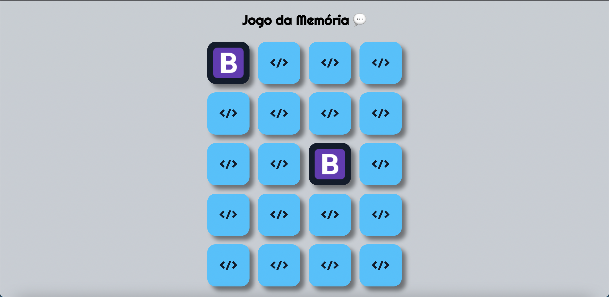
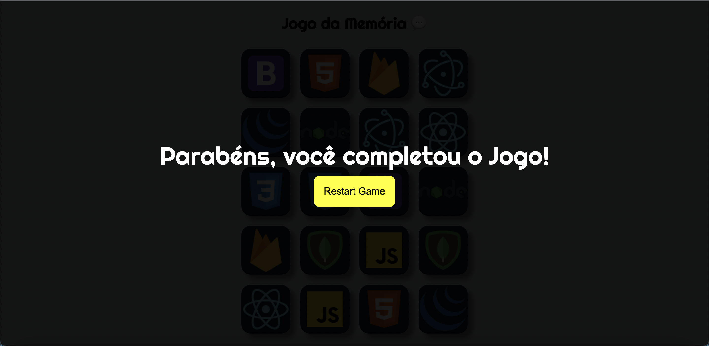

# Memory Game (Jogo da Memória) 💬

## Descrição 📋

Atualizaçao de um projeto feito inicialmente em HTML,CSS e JS e agora foi migrado para REACT.JS para praticar e desenvolver minhas habilidades.

## Interface do Jogo 📑

## Tecnologias Usadas 💻

 
 
  
 

